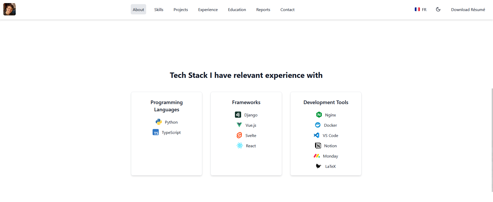
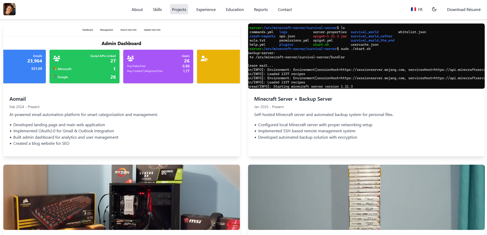
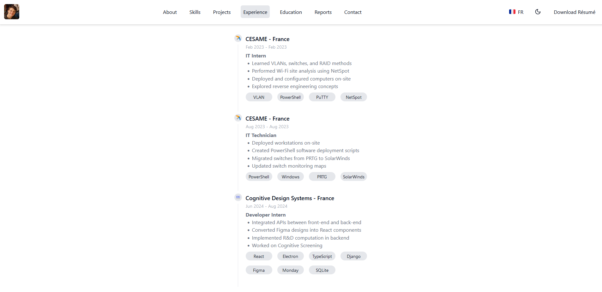
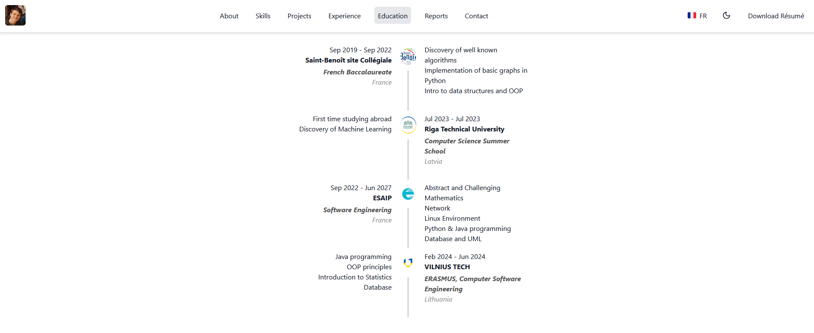
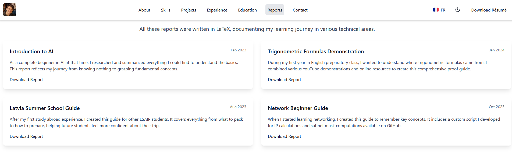

# Augustin ROLET Portfolio

This is my portfolio; you can use it as a template and modify it with attribution to my work. I have developed a dark mode and added a French translation.

## License

This project is licensed under the MIT License. You are free to:

- Clone it
- Modify it
- Use it for anything

If you like the design, feel free to fork the repository!




## Getting Started

Clone the repository:
```bash
git clone https://github.com/teloryfrozy/portfolio

npm install

npm run dev -- --open
```

# Home Page
In this section, you can provide a brief presentation of who you are and what you do. I have included my tech stack and contact links.

I have added my résumé for recruiters or curious visitors to download.

# Projects
List all your projects in `src/routes/projects/+page.svelte`, matching the Project interface:
```ts
interface Project {
    title: string;
    startDate: Date;
    endDate?: Date;
    description: string;
    advancedDescription: string;
    tasks: string[];
    details: string[];
    skills: string[];
    images: string[];
    githubLink?: string;
}
```



# Experiences
Include all your relevant professional experiences in `src/routes/experiences/+page.svelte`, matching the Experience interface:
```ts
interface Experience {
    country: string;
    company: string;
    role: string;
    startDate: Date;
    endDate?: Date;
    tasks: string[];
    technologies: string[];
    website?: string;
    logo: string;
}
```



# Education
List all your educational experiences/degrees/current involvements in `src/routes/educations/+page.svelte`, matching the Education interface:
```ts
interface Education {
    country: string;
    organization: string;
    degree: string;
    startDate: Date;
    endDate: Date;
    duration: string;
    courses: string[];
    website?: string;
    logo: string;
}
```



# Reports and Publications

Additionally, you can publish your internship reports, scientific publications you are proud of, and other relevant papers that showcase your skills in creating well-crafted professional documents.

You can find these in `src/routes/reports/+page.svelte`, matching the Report interface:
```ts
export interface Report {
    title: string;
    date: Date;
    description: string;
    filename: string;
}
```



## Improvements
> If you do not need to translate your portfolio and have many experiences, projects, or reports, you can create TypeScript files, export them as constants, and use them in your components. However, since Svelte does not create a store subscription for the language, you will not see language changes in real-time.

## Tracking
I have set up basic Google Analytics tracking to gather visitor information for personal statistics.

# Building
I used Vercel to deploy my portfolio to production for free. I also purchased the domain name `augustinrolet.com` through Vercel. You can find instructions on buying a domain [here](https://vercel.com/docs/getting-started-with-vercel/buy-domain).

If you are not using Vercel, remember to edit `svelte.config.js` with the appropriate adapter. I used the Vercel adapter, which you can find [here](https://svelte.dev/docs/kit/adapter-vercel).

You can easily sign up with your GitHub account and deploy your portfolio with Vercel in just a few minutes.
